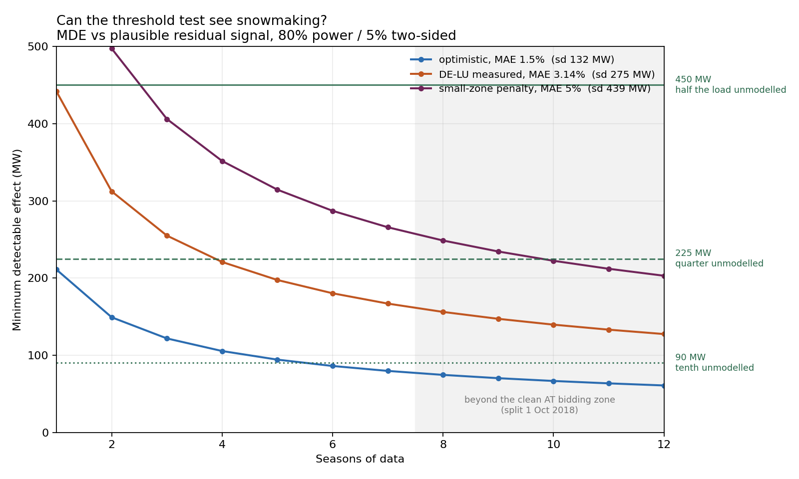
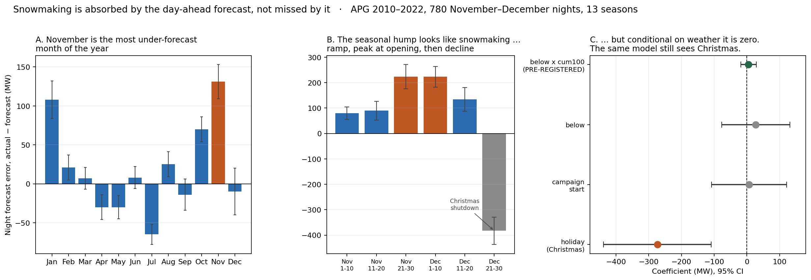

# Snowmaking as a hidden load in Austrian day-ahead electricity forecasts

### 📄 [Read the paper →](https://snowmaking-load-austria-baptiste7.vercel.app)

**Status: pre-registered, tested, null.** Two of the three kill criteria in §5
fired. The predictions and the stopping rules were written before any load data
was examined; commit history is the proof. Results in §8.

**Headline:** on 780 November–December nights across 13 seasons, the pre-registered
interaction is **+5.1 MW ± 11.9** — indistinguishable from zero. The identical
specification, on the identical nights, recovers the Christmas industrial shutdown
at **−274 MW (t = −3.3)**. The design can see effects of the size snowmaking would
have to produce. It does not see snowmaking.

---

## Abstract

Austrian ski resorts consume roughly 281 GWh of electricity per season making
artificial snow, concentrated into a few hundred cold night hours in November and
December. At full fleet coincidence that is 1.5 GW; at realistic coincidence,
0.6–1.1 GW, or 8–15% of Austria's overnight demand.

Snowmaking is a *task*, not a weather response. It runs only below a wet-bulb
threshold near −2 °C, it stops once the base layer is built, and it is
front-loaded before opening day. Two identical cold nights therefore draw very
different amounts of power depending on how much snow has already been made.

This repository tests whether that path dependence shows up as a systematic,
state-dependent error in published day-ahead load forecasts. The headline
prediction is not that cold nights are under-forecast — that is confounded by
heating load and probably already priced into any temperature coefficient. The
prediction is that **the threshold effect shrinks as season-to-date accumulated
cold rises**, which no memoryless temperature model can generate and no heating
confound can mimic.

A null result is the modal outcome and is reported either way.

---

## 1. The question

Transmission system operators publish a day-ahead load forecast. ENTSO-E and APG
both make the forecast and the realised load available for free. The difference
between them is the forecast error.

If snowmaking is genuinely invisible to the forecast, the error should be
positive (load under-predicted) on nights when snowmaking runs, and the size of
that miss should depend on the state of the snowpack rather than on temperature
alone.

## 2. How big is the load?

From Aigner, Steiger & Mayer (2026), a survey of 141 Austrian resorts, 30 usable,
covering 4,253 equipped hectares or 34.0% of Austrian ski volume:

| Quantity | Value |
|---|---|
| Season electricity, Austria-wide | **281 GWh** (range 260–309) |
| Share of Austrian electricity consumption | 0.46% |
| Mean operating hours per snowmaker per season | **184.6 h** |
| Snowmakers per hectare | 2.9 |
| Energy per hectare equipped | 22,449 kWh |
| Energy per m³ of snow | 3.3 kWh |

The instantaneous power follows from energy over operating hours:

```
Fleet-wide coincident ceiling = 281 GWh / 184.6 h = 1.52 GW

Mean draw per snowmaker while running = 41.9 kW
  Consistent with a lance/fan-gun mix plus pumping and compressed air.
  Internal cross-check passes.

At realistic coincidence:
  40% → 0.61 GW      60% → 0.91 GW
  50% → 0.76 GW      70% → 1.07 GW
```

Austrian weekday overnight load in November and December runs 7.0–7.5 GW
(sampled: 10 Dec 2024 at 7.12–7.48 GW, 5 Dec 2023 at 7.17–7.60 GW). Snowmaking is
therefore **8–15% of overnight demand**, centred near 12%.

Reproduce with `python src/magnitude.py`.

### Two caveats carried forward

**Older figures are too high.** Steiger et al. (2021) put Austrian snowmaking at
355–950 GWh/season. The 2026 survey states these are overestimates. All arithmetic
here uses 281 GWh.

**Part of the load is not in the dependent variable.** APG's published total load
covers all of Austria since 2012 *"mit Ausnahme eines Korridors in Vorarlberg"* —
except a corridor in Vorarlberg, a legally separate control area (VÜN, §23 ElWOG
2010) jointly operated with APG since 1 Jan 2012. Vorarlberg holds real snowmaking
capacity (Lech/Zürs, Montafon) and consumes 2,667 GWh/yr in total. The analysis
reports results with Vorarlberg weighted at 0.10 and at 0.00 in the weather index.

## 3. Why the forecast might miss it — and why it might not

The naive version of this hypothesis is that load forecasts are temperature
models and temperature models have no memory. Two mechanisms argue against it,
and both shrink the expected effect:

**A memoryless model still absorbs the average response.** The temperature
coefficient is estimated on history in which cold nights *are* snowmaking nights.
The model does not need to know snowmaking exists to price it in on average. What
remains in the residual is the deviation from the conditional mean given
temperature — the snowmaking *anomaly*, not the snowmaking *load*.

**Production forecasts are autoregressive.** APG publishes at 08:00 for the
following day and lists its inputs as historical actual load, day type including
holiday calendar, and temperature forecast. Yesterday's actual is already in
there. Any lagged-load term propagates a running snowmaking campaign into
tomorrow's forecast, so the effect survives on the *first* night of a campaign and
decays over the following 24–48 hours.

Call α the share of snowmaking load the forecast leaves unexplained. These two
mechanisms push α down, and §6 shows α is the binding constraint on the whole
design.

## 4. Identification

The obvious test — compare nights just below the wet-bulb threshold to nights
just above — is contaminated. At 1,800 m, −2 °C wet bulb corresponds to roughly
−1 to 0 °C air temperature, and every nonlinearity in heating load lives near
freezing: heat-pump COP collapse and resistive backup cutover, defrost cycles,
pipe and road trace heating. Humidity, which enters wet bulb, is itself a load
driver.

The identifying variation is therefore not the threshold crossing but its
**interaction with accumulated season-to-date cold**:

```
err ~ below × cum_cold_hours
      + dist + below:dist
      + hour FE + dow FE + season FE
      (SE clustered by date, bandwidth ±3 °C around the threshold)

err            = actual load − day-ahead forecast, MW
below          = 1 if the alpine wet-bulb index < −2 °C
dist           = wb_index − (−2)
cum_cold_hours = hours below threshold since 1 Oct, current season
```

Heating load does not care how many cold hours the season has already delivered.
Snowmaking does, because the base gets built and the guns stop. The interaction is
the only coefficient in this design that a temperature confound cannot produce.

### Building the wet-bulb index

Three things that decide the answer before the econometrics do:

- **Altitude band.** Snowmaking happens at 1,200–2,500 m. Valley stations cross
  the threshold hundreds of hours later. Stations are selected at 900–2,600 m.
- **Station pressure.** ISA pressure at 1,800 m is 815 hPa. Assuming sea level
  shifts wet bulb by 0.2–0.4 °C, comparable to the RD bandwidth.
- **Solver, not closed form.** The Stull (2011) approximation errs by ~0.7–1.0 °C
  at sub-zero temperatures, worse than the effect being chased. `src/snowload.py`
  bisects the psychrometric equation instead, agreeing with reference tables to
  ~0.2 °C.

Regions are weighted by state share of Austrian skier visits: Tirol 0.50,
Salzburg 0.24, Vorarlberg 0.10, Steiermark 0.09, Kärnten 0.05.

### On the threshold value

There is no lance-versus-fan-gun threshold split. Olefs et al. (2010) report that
manufacturers quote −1.5 °C wet bulb for both air-water lances and fan guns, and
round to −2 °C; TechnoAlpin quotes −2.5 °C with no equipment distinction. The
documented lance/fan difference is water loss (15–40% vs 5–15%), not temperature.

The threshold is soft for economic reasons instead: marginal production starts
near −2 °C, efficient production wants −4 °C or colder, and how early a resort
starts depends on how far behind its base is. That state dependence is what the
interaction exploits.

## 5. Pre-registered predictions and kill criteria

**Primary prediction.** The `below × cum_cold_hours` coefficient is negative and
significant at 5% with date-clustered standard errors.

**Supporting predictions.**

1. *Campaign starts.* Defining a start as the first hour below threshold after
   ≥48 h above it, the forecast error spikes on night 1 and decays over 24–48 h.
   A temperature confound gives a flat profile across campaign days.
2. *Opening dates.* Conditional on wet bulb and day of season, the error is
   smaller after resorts open than before.
3. *Placebos.* The Netherlands and Denmark, run through the identical pipeline,
   show no effect. Summer months show no effect.

**Kill criteria, committed before looking:**

- The NL placebo shows the same jump → the result is heating load. Stop.
- The interaction coefficient is zero or positive with a tight confidence
  interval → no memory effect. Stop.
- The event-study profile is flat across campaign days → the forecast already
  absorbs it. Stop.

**Publication commitment.** All three outcomes get written up. A null is the
modal outcome and the interesting question either way is how much of a large,
physically lumpy, path-dependent industrial load a production forecast can absorb
without being told about it.

## 6. Statistical power



Assumptions: 9 snowmaking episodes per November–December season, 8 night hours
each, within-episode residual correlation 0.7, overnight load 7.0 GW, 80% power at
5% two-sided. Error scale anchored on a measured figure: the DE-LU zone TSO
day-ahead load forecast has MAE of 3.14% of mean load over 2016–2019 ENTSO-E data.
Austria is a smaller zone, so its relative error is likely worse. MAE converted to
standard deviation assuming near-normal errors.

| Day-ahead forecast error | sd | MDE at 4 seasons | at 7 | at 12 | α needed at 7 seasons |
|---|---|---|---|---|---|
| optimistic, MAE 1.5% | 132 MW | 105 MW | 80 MW | 61 MW | **8.9%** |
| DE-LU measured, MAE 3.14% | 275 MW | 221 MW | 167 MW | 127 MW | **18.5%** |
| small-zone penalty, MAE 5% | 439 MW | 352 MW | 266 MW | 203 MW | **29.5%** |

Read the last column as the pass mark. With the seven clean seasons available
since the bidding-zone split, the forecast must be missing at least ~19% of
snowmaking load for the test to have 80% power.

**More data does not fix this.** Going from 7 to 12 seasons moves the pass mark
only from 18.5% to 14%. The binding constraint is α, and α is decided by §3.

The first computation once load data is in hand is therefore the measured
Austrian forecast error standard deviation, which collapses this table to one
row. `src/snowload.py` prints it before running anything else.

Reproduce with `python src/power.py`.

## 7. Data

| Series | Source | Access |
|---|---|---|
| AT day-ahead total load forecast (A65) | ENTSO-E Transparency | free token, ~3 working days |
| AT actual total load (A16) | ENTSO-E Transparency | same token |
| AT actual load, 15-min, **2009–2022** | markt.apg.at `Gesamtlast.zip` | no registration |
| AT day-ahead forecast, 15-min, **2010–2022** | markt.apg.at `Prognose über die Gesamtlast.zip` | no registration |
| Hourly temperature and humidity, alpine stations | GeoSphere Austria `klima-v2-1h` | no key |
| Resort opening dates | resort sites and Wayback | manual, ~30 resorts |

**The APG archives go back to 2009, not 2024 as the web view implies.** Each is a
ZIP of per-year ZIPs, each holding one CSV. That is thirteen overlapping seasons
with no token, no registration and no waiting — more history than the ENTSO-E
route would have given for this test, since the load series is continuous across
the 2018 bidding-zone split and only prices broke. The results in §8 use APG.

The ENTSO-E token remains free and is still worth having for the NL/DK placebos
and any move to price or imbalance outcomes: register at transparency.entsoe.eu,
email transparency@entsoe.eu with subject "RESTful API access", approval within
three working days, then generate the token under My Account.

Raw data is not committed. `data/README.md` documents exactly how to fetch it.

### Structural breaks

- **1 Oct 2018.** The DE-AT-LU bidding zone split took effect. The load series is
  continuous; the price series is not. Seven clean seasons follow.
- **Season 2020/21.** Austrian lifts shut in the November lockdown, reopened
  24 December, hotels and borders closed, effectively locals-only. Resorts still
  made snow. Excluded from the main sample, then used as a bonus test: the
  coefficient should shrink, not vanish. If it vanishes, the design was measuring
  tourism rather than snowmaking.

## 8. Results

Sections 1–7 were written first and have not been edited since the data was
opened; the commit history is the proof. The headline block at the top of this
file reports results, so it tracks them, and it was corrected along with §8 in
the pass described in §8.10.



### 8.1 Sample

APG publishes both series back to 2009 with no registration, which turned out to
be more history than the ENTSO-E route would have given and removed the token from
the critical path. Forecast coverage starts 2010, so:

| | |
|---|---|
| Joined hourly observations | 113,939 (2010-01-01 to 2022-12-31) |
| Seasons | 13 |
| Nov–Dec nights, ≥8 hours in the 20:00–06:59 window | **780** |
| Alpine stations in the wet-bulb index | 13, deduplicated, 1,221–2,327 m |
| Index hours (Oct–Dec) | 28,704 |
| Campaign starts identified | 52 |

Stations include Ischgl-Idalpe (2,327 m), Rudolfshütte (2,317 m), Patscherkofel
(2,251 m), Galzig (2,079 m), Villacher Alpe (2,140 m) and Schmittenhöhe (1,956 m) —
the index sits where snow is actually made, not in the valleys.

### 8.2 The gate: the Austrian forecast is much noisier than assumed

| Nov–Dec night hours, 2010–2022 | |
|---|---|
| Mean load | 6,585 MW |
| Bias (actual − forecast) | **+59.6 MW** |
| MAE | 427 MW, **6.48% of load** |
| sd, raw | 608 MW |
| sd, after hour/dow/season fixed effects | **554 MW** |
| Implied α pass mark, 13 seasons | **27.4%** |

The DE-LU benchmark used in §6 was 3.14%. Austria is roughly twice as hard to
forecast, worse than the most pessimistic of the three scenarios. The bar the
hypothesis had to clear was therefore ~27% of the snowmaking load left
unexplained, not the ~19% anticipated.

These figures are computed over the same 20:00–06:59 night used for estimation.
The first published version of this table used a narrower 21:00–05:59 window by
mistake, which is where its 6,420 MW / 417 MW / 597 MW came from; see §8.10. The
ratio that the argument actually turns on barely moved — 6.48% against 6.50% —
so the conclusion of this section is unchanged.

### 8.3 What the raw seasonal profile looked like

Before conditioning on weather, the descriptive pattern was encouraging.
November is the most under-forecast month of the year:

| Month | Night bias (MW) | | Month | Night bias (MW) |
|---|---|---|---|---|
| Oct | +70 ± 16 | | Apr | −30 ± 16 |
| **Nov** | **+131 ± 22** | | Jun | +8 ± 14 |
| Dec | −10 ± 30 | | Jul | −65 ± 13 |
| Jan | +108 ± 24 | | Aug | +25 ± 16 |

And within November–December, in 10-day bins, the bias rises to a peak in early
December then collapses:

| Nov 1–10 | Nov 11–20 | Nov 21–30 | Dec 1–10 | Dec 11–20 | Dec 21–30 |
|---|---|---|---|---|---|
| +80 ± 25 | +90 ± 37 | +223 ± 48 | **+223 ± 41** | +134 ± 47 | −383 ± 54 |

That hump is the right shape and the right order of magnitude for snowmaking:
too warm to make snow in early November, a ramp into the opening-day crunch, then
decline as bases are built. The Dec 21–30 collapse is the Christmas industrial
shutdown.

It is also exactly what a seasonal heating ramp produces. Separating them is what
the pre-registered specification is for.

### 8.4 The pre-registered test

`err ~ below × cum100 + dist + below:dist + holiday + doy + doy² + season FE + dow FE`,
night-level observations, HC1 standard errors.

| Specification | n | `below:cum100` **(primary)** | `below` | `holiday` |
|---|---|---|---|---|
| Nov–Dec, all nights | 780 | **+5.1** (11.9), t = 0.43 | +27.2 (53.2) | **−273.6** (84.0), t = −3.26 |
| Bandwidth \|wb+2\| ≤ 3 °C | 418 | **+4.2** (14.7), t = 0.29 | +39.8 (83.1) | −210.0 (121.2) |
| With campaign-start dummies | 780 | **+5.4** (12.0), t = 0.45 | +23.1 (55.1) | −273.7 (84.0), t = −3.26 |
| Seasons 2016–2022 only | 420 | **−7.9** (11.5), t = −0.69 | −3.3 (49.5) | **−372.0** (92.7), t = −4.01 |

Standard errors in parentheses.

Campaign-start effects, testing the highest-α scenario where autoregressive terms
have not yet caught up. Both dummies enter the same specification:

| Term | Coefficient | SE | t |
|---|---|---|---|
| `campaign_start` (first night of a cold snap) | +6.3 | 58.6 | 0.11 |
| `campaign_night2` | −91.7 | 86.7 | −1.06 |

### 8.5 Verdict against the pre-registered kill criteria

> *"The interaction coefficient is zero or positive with a tight confidence
> interval → no memory effect. Stop."*

**Fired.** +5.1 MW with a standard error of 11.9, stable across four
specifications and carrying the wrong sign in three of them; the one negative
estimate, −7.9 in the 2016–2022 subsample, is smaller than its own standard
error. The 95% interval is roughly [−18, +28] MW per 100 accumulated cold hours.

> *"The event-study profile is flat across campaign days → the forecast already
> absorbs it. Stop."*

**Fired.** Both campaign-start coefficients are indistinguishable from zero and
carry the wrong sign.

The NL/DK placebo was not run. With two of three criteria met it is moot: there
is no effect for a placebo to discredit.

### 8.5b The opening-date test cannot be identified from calendar dates

The third supporting prediction — that the effect shrinks once resorts open — was
run and is reported here for completeness, with the caveat that it does not
identify anything.

Austrian opening dates are tightly clustered: glaciers from late September
(Sölden, Kitzsteinhorn, Hintertux year-round) at roughly 3–5% of equipped capacity,
Obergurgl 16 November, Ischgl 25 November, Obertauern late November, St Anton
1 December, and the bulk of the country between 8 and 20 December. Encoding that as
a capacity-open share and interacting it with the threshold gives:

| Term | Coefficient | SE | t |
|---|---|---|---|
| `below × open_share` | −301.8 | 266.6 | −1.13 |
| `below × open_share`, bandwidth 3 °C | −246.8 | 387.2 | −0.64 |

The sign is the predicted one. The precision is useless, and the reason is
mechanical: regressing the opening-share curve on the day-of-season controls
already in the specification gives **R² = 0.798**. A fixed calendar curve is four-
fifths explained by a smooth function of the date, so only a fifth of its variation
is available to identify anything. Adding it also inflates the standard error on the
primary interaction from 11.9 to roughly 30, which is collinearity rather than
information.

The two coefficients in the table above are the only numbers in §8 that the
corrected pipeline does not regenerate: they need per-resort opening dates, and
`data/opening_dates.csv` is not in this repository. They are carried over from the
first run and therefore still contain the timezone error described in §8.10. The
conclusion does not depend on them — the test is closed as not identifiable on the
strength of R² = 0.798, which is a property of the calendar, not of the estimate.

**What would fix it:** season-varying opening dates. Resorts open late in bad snow
years and early in good ones, and that variation is orthogonal to the calendar.
Recovering it means resort-level opening dates for each of the thirteen seasons,
which is a Wayback Machine exercise across ~30 resorts and was not attempted here.
The pre-registration is closed as *not identifiable with the data collected*,
which is a different statement from *tested and null*.

### 8.6 Why this is a null and not merely an absence of evidence

The specification is not underpowered for effects of the relevant size. On the
same 780 nights, with the same fixed effects and the same standard errors, it
recovers the Christmas industrial shutdown at −274 MW with t = −3.3, rising to
−372 MW and t = −4.0 in recent seasons. A real night-level swing of a few hundred
megawatts is visible to this design. The snowmaking interaction is +5 ± 12.

The most likely explanation is the one anticipated in §3. Snowmaking is not
invisible to the forecast; it is *absorbed* by it. A temperature coefficient
estimated on thirteen years in which cold alpine nights are snowmaking nights
prices in the average response without needing to know snowmaking exists, and
APG's use of lagged actual load carries a running campaign into the next day's
forecast. What remains for the residual is too small to find, and probably too
small to matter.

The +131 MW November bias in §8.3 survives as a real seasonal feature. It is not
attributable to snowmaking by this design.

### 8.7 What would still be worth doing

- **Opening dates.** The one pre-registered supporting test not run, and the only
  remaining source of variation orthogonal to temperature.
- **Price and imbalance as outcomes.** §9 already notes the load forecast error is
  the TSO's error, not the market's. A null here does not rule out a price effect.
- **Systems where the load is a larger share of demand.** The binding constraint was
  α, not sample size. See §8.8 for the worldwide ranking.

### 8.8 Was Austria a badly chosen case? Mostly not

A null is only interesting if the test was fair. Ranking candidate systems by
snowmaking energy per gigawatt of winter overnight load — Austria's 281 GWh ÷ ~7 GW
= **43 GWh/GW** — puts Austria near the top of the world, not the middle.

> **No country other than Austria was analysed.** Everything in this section is
> desk scoping: published or derived snowmaking energy divided by published system
> load. No load series, forecast series or regression was run for any other system.
> These are targets for replication, not results.

| System | Snowmaking (GWh/season) | Winter overnight load (GW) | Ratio | Free day-ahead forecast? |
|---|---|---|---|---|
| **ISO-NE Vermont region** | 40–90 *(derived)* | ~0.62–0.70 | **62–140** | Yes, hourly, per region, ~9 yr |
| Italy-North | ~560 *(derived)* | ~12–13 | ~45 | Yes, Terna, per bidding zone |
| **Austria (this study)** | **281 (published)** | **~7** | **43** | Yes |
| ISO-NE New Hampshire | 22–54 *(derived)* | ~1.25 | 18–43 | Yes |
| PSCO (Xcel Colorado) | 45–70 *(derived)* | ~3.5–4.5 | 11–18 | Yes, EIA-930 |
| Switzerland | 60–65 (published) | ~8.4 | 7.1–7.7 | Yes, Swissgrid |
| France | >110 (published) | ~60 | 1.8 | Yes, ODRÉ éCO2mix |
| Germany | ≤43 incl. lifts | ~52 | ≤0.8 | Yes, SMARD |

Derived figures scale equipped hectares by the Austrian intensity of 22,449 kWh/ha.
No published national snowmaking-energy total exists outside Austria, Switzerland
and France, so everything else in that column is an estimate.

**Austria was a fair test.** Only two systems plausibly beat it, and one is a
sub-region rather than a country. Switzerland is six times worse, France
twenty-four, Germany fifty. This is not the null of a badly chosen case.

**The best remaining test is Vermont, not a country.** ISO-NE publishes an hourly
demand forecast *per reliability region*. Vermont's ~0.65 GW zonal load sits under a
snowmaking fleet covering close to 100% of trail acreage, because US Northeast
resorts snowmake far harder than the Alps where natural snowfall is unreliable.
Resort-level derivations (Jiminy Peak, Sugarbush) put Northeast intensity at
**3–7× the Austrian 22.4 MWh/ha**. Rhode Island provides a same-forecaster,
same-weather, zero-snowmaking placebo inside the same data feed.

One caveat must be resolved first: ISO-NE's regional report expresses each region as
a percentage of the zonal total, which suggests the system forecast may be allocated
to regions by load-share factors rather than each region being forecast
independently. If so the forecast is structurally incapable of seeing a
Vermont-specific anomaly, and a positive result would mean "no regional model"
rather than "snowmaking is missed."

**Andorra has the best physics on earth and no data.** Snowmaking at Grandvalira and
Pal Arinsal against a 570 GWh national system is plausibly a several-percent share of
national load, but FEDA sits outside ENTSO-E and publishes no hourly series. Same for
China's Chongli cluster, built in a very dry climate for the 2022 Olympics.

### 8.9 The ENTSO-E token was never necessary

Two data findings, either of which would have saved days of assumed waiting.

**APG's archives go back to 2009**, not 2024 as the web view implies, as nested
per-year ZIPs with no registration. That alone covered this entire study.

**energy-charts.info (Fraunhofer ISE) serves day-ahead load forecast and actual load
for most European bidding zones with no token and no registration:**

```
https://api.energy-charts.info/public_power_forecast?country=XX&production_type=load&forecast_type=day-ahead
https://api.energy-charts.info/public_power?country=XX          # series "Load"
https://api.energy-charts.info/price?bzn=XX                     # day-ahead spot
```

On futures: EEX and ICE historical settlement data is paywalled (EEX Group
DataSource, roughly €45–80/month, redistribution prohibited), so a futures-lag test
is not feasible on free data. Day-ahead *spot* is free from the endpoint above and is
the honest substitute, labelled as spot rather than futures.

### 8.10 Correction: four defects found when the pipeline first ran end to end

The numbers first published in §8 came out of a browser JavaScript context,
because the machine that ran the analysis had no network route to APG or
GeoSphere. `src/apg_pipeline.py` is the portable Python reimplementation, and
until now nobody had run it start to finish. Running it found four problems. The
tables above report the corrected output.

**1. The wet-bulb index sat an hour off.** GeoSphere stamps its timestamps UTC
(`2015-12-01T00:00+00:00`). APG publishes local CET/CEST wall clock
(`Time from [CET/CEST]`). Both runs joined the two on the raw hour string, so each
load hour drew the wet bulb of the next local hour, and of the hour after that
during October's CEST. Only this correction moves the headline: the primary
interaction shifts from +1.3 (11.8) to +5.1 (11.9). It still cannot be told apart
from zero and still carries the sign opposite to the prediction, so §8.5 stands.

**2. The cold accumulator counted night hours only.** The code built `cum_cold_h`
after filtering the panel to 20:00–06:59, so it summed about 497 below-threshold
hours per season where the pre-registration asks for hours below threshold since
1 October, about 1,011 of them. The running variable came out half its intended
size, which inflated each coefficient and standard error attached to it by a
factor near 2.05.

**3. Daylight saving crashed the parser.** APG writes the repeated October hour as
`2A` and `2B` instead of a number. The Python did not handle it and crashed on the
first run, before producing a single number. Folding both onto hour 02 and
averaging them, which the function's docstring already claimed to do, costs 13
hours and leaves 113,939.

**4. The gate table measured a different night than the sample it described.** The
original 6,420 MW, 417 MW and 597 MW in §8.2 reproduce to the decimal on a
21:00–05:59 night rather than the registered 20:00–06:59 one. §8.2 now uses the
registered window. The MAE ratio the argument rests on moves from 6.50% to 6.48%.

One number resisted every specification tried: the 514 MW standard deviation after
hour, day-of-week and season fixed effects. The registered window gives 554 MW,
which lifts the implied α pass mark from 25.4% to 27.4%. §8.2 reports 554.

Two of the six 10-day bins in §8.3 also shifted by about 10 MW against standard
errors near 40, and the cause is not identified. The seasonal shape they describe
is the same.

Nothing above §8 changed. The pre-registration, the kill criteria and the power
calculation stand as committed.

## 9. Limitations

- Roughly 360 relevant hours per season, heavily autocorrelated. Effective sample
  size is episodes, not hours.
- The published forecast is the TSO's transparency artefact, not the trading
  consensus. A systematic bias in it demonstrates a blind spot in APG's forecast,
  **not** a market mispricing. Establishing the latter requires day-ahead price or
  imbalance as the outcome and is a separate study.
- Part of Vorarlberg is outside the published load series (§2). Vorarlberg carries
  weight 0.10 in the wet-bulb index while some of its load is absent from the
  dependent variable, which adds noise at exactly the threshold.
- **Opening dates were not collected.** This is the one pre-registered supporting
  test that was not run, and the only remaining identifying variation orthogonal
  to temperature.
- **The NL/DK placebo was not run.** With the primary coefficient at zero there is
  no effect for it to discredit, but the pipeline supports it (`snowload.py`) and
  it would tighten the write-up.
- The wet-bulb index uses 13 stations weighted by state share of skier visits, not
  by equipped hectares. A capacity-weighted index would be better and is unlikely
  to move a coefficient this close to zero.
- `cum_cold_h` proxies the snow stock with accumulated hours below threshold. It
  ignores melt, and it counts cold hours whether or not guns actually ran. A true
  stock variable would need production data no resort publishes.

## 10. Reproduce

**To reproduce §8 from scratch, no token and no registration required:**

```bash
pip install -r requirements.txt
python src/apg_pipeline.py
```

That downloads both APG archives, unpacks the nested per-year ZIPs, joins the
15-minute actual load to the 15-minute day-ahead forecast at hourly resolution,
selects the alpine stations, solves the psychrometric wet bulb with the station
pressure correction, builds the region-weighted index and the season-to-date cold
accumulator, detects campaign starts, writes `data/night_panel.csv`, and prints
the gate statistics followed by all four specifications. Runtime is a few minutes,
most of it the two ~6 MB downloads.

The other scripts stand alone:

```bash
python src/magnitude.py           # load magnitude arithmetic, no data needed
python src/power.py               # detectability calculation, no data needed

export ENTSOE_TOKEN=...           # see §7 — only needed for the ENTSO-E route
python src/snowload.py --seasons 2018 2019 2021 2022 2023 2024
```

`snowload.py` is the ENTSO-E path, kept because it also handles the NL/DK
placebos and multi-country comparison that APG cannot serve. `apg_pipeline.py` is
what produced the reported results.

`snowload.py` selects alpine stations by altitude and state, solves the
psychrometric wet bulb with a station-pressure correction, builds the
region-weighted index and the season-to-date cold accumulator, detects campaign
starts, and runs all four specifications plus the placebos. It prints the measured
forecast error standard deviation and the implied α pass mark before anything
else, so the go/no-go decision comes first.

## References

- Aigner, Steiger & Mayer (2026). *Snowmaking in Austria: resource consumption and greenhouse gas emissions.* Journal of Sustainable Tourism. [Article](https://www.tandfonline.com/doi/full/10.1080/09669582.2026.2656746) · [Figures](https://ciss-journal.org/article/view/11546) · [PDF](https://zukunft-skisport.at/wp-content/uploads/2025-09-16_IMC-Innsbruck_Snowmaking_Aigner-Steiger-Mayer_final.pdf)
- Olefs, Fischer & Lang (2010). *Boundary conditions for artificial snow production in the Austrian Alps.* J. Appl. Meteorol. Climatol. 49(6). [Article](https://journals.ametsoc.org/view/journals/apme/49/6/2010jamc2251.1.xml)
- Stull (2011). *Wet-bulb temperature from relative humidity and air temperature.* J. Appl. Meteorol. Climatol. 50(11). (Used as a benchmark, not in the pipeline.)
- [APG actual total load](https://markt.apg.at/en/transparency/load/actual-total-load/) and [total load forecast](https://markt.apg.at/en/transparency/load/total-load-forecast/)
- [VÜN Netzentwicklungsplan 2025](https://www.e-control.at/documents/1785851/0/VUEN+NEP+2025.pdf), E-Control
- [EPEX SPOT, DE-AT-LU bidding zone split](https://www.epexspot.com/en/news/epex-spot-publish-separate-prices-and-volumes-austrian-and-german-day-ahead-markets)
- [Maldonado et al., arXiv 2302.11017](https://ar5iv.labs.arxiv.org/html/2302.11017) — DE-LU TSO day-ahead load forecast MAE
- [GeoSphere Austria Dataset API](https://dataset.api.hub.geosphere.at/v1/docs/)
- [ENTSO-E Transparency Platform](https://transparency.entsoe.eu/)

## License

MIT. See [LICENSE](LICENSE).
